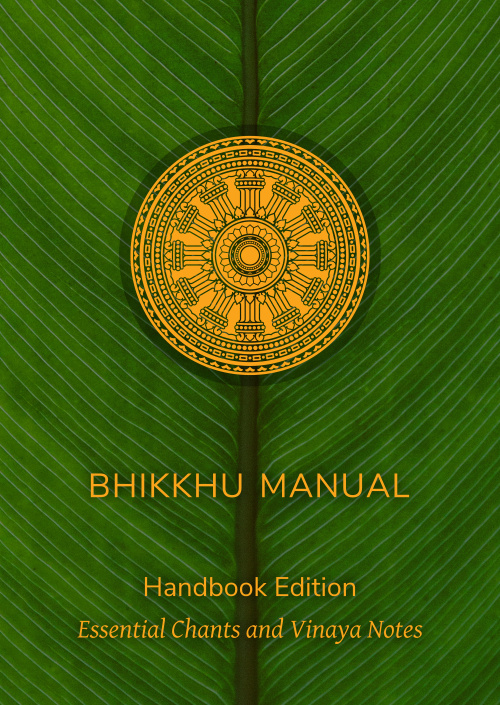

  
  <h1>Bhikkhu Manual</h1>
  <a href="https://bhikkhu-manual.github.io">bhikkhu-manual.github.io</a>

  
<em>Last updated on: 2024-12-25</em>

## Downlads

*(NOTE: See the [Print Guide](./print-guide.html) for press-quality print files and guidelines.)*

  

    
  

  

    <h3>Bhikkhu Manual Handbook Edition</h3>
    
<em>Essential Chants and Vinaya Notes</em>

    
<a href="https://bhikkhu-manual.github.io/includes/docs/Bhikkhu-Manual-Handbook.pdf">PDF</a>

  

  

    
  

  

    <h3>Bhikkhu Manual Reference Edition</h3>
    
<em>All Chants with English Translations and Vinaya Notes</em>

    
<a href="https://bhikkhu-manual.github.io/includes/docs/Bhikkhu-Manual-Reference.pdf">PDF for desktop and office printing</a>

    
<a href="https://bhikkhu-manual.github.io/includes/docs/Bhikkhu-Manual-Reference.epub">EPUB for phones and tablets</a>

    
<a href="https://bhikkhu-manual.github.io/includes/docs/Bhikkhu-Manual-Reference.mobi">MOBI for Kindle</a>

  

## Further references

### Discipline and Conventions of the Theravada Forest Tradition

*by Ajahn Sucitto*

- [PDF](https://bhikkhu-manual.github.io/includes/docs/Discipline-and-Conventions-Ajahn-Sucitto.pdf), [EPUB](https://bhikkhu-manual.github.io/includes/docs/Discipline-and-Conventions-Ajahn-Sucitto.epub), [MOBI](https://bhikkhu-manual.github.io/includes/docs/Discipline-and-Conventions-Ajahn-Sucitto.mobi)

### Rituals & Observances

*by Ajahn Sucitto and Ajahn Candasiri*

- [PDF](https://bhikkhu-manual.github.io/includes/docs/Rituals-and-Obervances-Ajahn-Sucitto-and-Ajahn-Candasiri.pdf)

